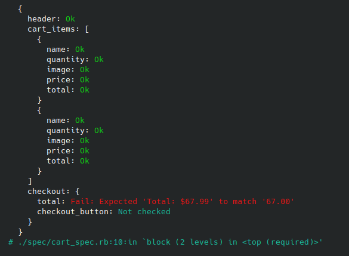

[](https://codeclimate.com/github/prism-checker/prism_checker/maintainability)
[](https://codeclimate.com/github/prism-checker/prism_checker/test_coverage)

## Overview

Prism checker - short and easy-to-read browser tests with clear error messages.
Prism checker - extensions for rspec and minitest, built on top of the site_prism gem and uses its Page Object Model.

For example, we need to test the online shop cart:


Corresponding SitePrism Page Object Model:

```ruby
class Cart < SitePrism::Page
  set_url '/cart.html'

  element :header, 'h1'

  sections :cart_items, '[data-test="cart-item"]' do
    element :name, '[data-test="cart-item-name"]'
    element :image, '[data-test="cart-item-image"]'
    element :price, '[data-test="cart-item-price"]'
    element :quantity, '[data-test="cart-item-quantity"]'
    element :total, '[data-test="cart-item-total"]'
  end

  section :checkout, '[data-test="cart-checkout"]' do
    element :total, '[data-test="cart-checkout-total"]'
    element :checkout_button, '[data-test="cart-checkout-button"]'
  end
end
```

A typical test would look like this:

```ruby
describe 'Cart' do
  it 'is correct' do
    page = Cart.new
    page.load
    
    expect(page.header.text).to eq('Shopping Cart')

    expect(page.cart_items.size).to eq(2)

    expect(page.cart_items[0].visible?).to be_truthy
    expect(page.cart_items[0].name.text).to match('Cup')
    expect(page.cart_items[0].quantity.value).to match('1')
    expect(page.cart_items[0].image[:src]).to match('cup.png')
    expect(page.cart_items[0].price.text).to match('19.00')
    expect(page.cart_items[0].total.text).to match('19.00')

    expect(page.cart_items[1].visible?).to be_truthy
    expect(page.cart_items[1].name.text).to match('Cap')
    expect(page.cart_items[1].quantity.value).to match('2')
    expect(page.cart_items[1].image[:src]).to match('cap.png')
    expect(page.cart_items[1].price.text).to match('24.00')
    expect(page.cart_items[1].total.text).to match('48.00')

    expect(page.checkout.visible?).to be_truthy
    expect(page.checkout.total.text).to match('67.99')
    expect(page.checkout.checkout_button.text).to match('Checkout')
  end
end
```

Using gem prism_checker, the same test will look much cleaner and simpler:

```ruby
describe 'Cart' do
  it 'is correct' do
    page = Cart.new
    page.load

    expect(page).to be_like(
      header: 'Shopping Cart',
      cart_items: [
        {
          name: 'Cup',
          quantity: '1',
          image: 'cup.png',
          price: '19.00',
          total: '19.00'
        },
        {
          name: 'Cap',
          quantity: '2',
          image: 'cap.png',
          price: '24.00',
          total: '48.00'
        }
      ],
      checkout: {
        total: '67.00',
        checkout_button: 'Checkout'
      }
    )
  end
end

```

In case of errors, an easy-to-read message will be displayed:



**Note.**
_All examples are for rsepc, for mintest it will be the same, but instead of expect(page).be_like(expectation) it will be assert_page_like(page, expectation)_

## Install
To install PrismChecker:

### RSpec

```bash
gem install prism_checker_rspec
```
### MiniTest

```bash
gem install prism_checker_minitest
```

## Examples
### Common cases

Page and Page Object Model:


```ruby
class Cart < SitePrism::Page
  element :header, 'h1'

  sections :cart_items, '[data-test="cart-item"]' do
    element :name, '[data-test="cart-item-name"]'
    element :price, '[data-test="cart-item-price"]'
  end

  section :checkout, '[data-test="cart-checkout"]' do
    element :total, '[data-test="cart-checkout-total"]'
    element :checkout_button, '[data-test="cart-checkout-button"]'
  end 
end
```


#### Check text on the page

```ruby
@page = Cart.new
page.load

expect(page).to be_like('Shopping Cart')

# Same as
# expect(page.loaded?).to eq(true)
# expect(page).to match('Shopping Cart')
```


#### Check element and section

```ruby
@page = Cart.new
page.load

expect(page).to be_like(
  header: 'Shopping Cart',
  checkout: {
    total: '67.99',
    checkout_button: 'Checkout'
  }
)

# Same as
# expect(page.loaded?).to eq(true)
# expect(page.header.visible?).to eq(true)
# expect(page.header.text).to match('Shopping Cart')
# expect(page.checkout.visible?).to eq(true)
# expect(page.checkout.total.visible?).to eq(true)
# expect(page.checkout.total.text).to match('67.99')
# expect(page.checkout.checkout_button.visible?).to eq(true)
# expect(page.checkout.checkout_button.text).to match('Checkout')
```


#### Check element

```ruby
@page = Cart.new
page.load

# page.header is inspected, not page                         

expect(page.header).to be_like('Shopping Cart')

# Same as
# expect(page.header.visible?).to eq(true)
# expect(page.header.text).to match('Shopping Cart')
```
```ruby
@page = Cart.new
page.load

# page is inspected                         

expect(page).to be_like(header: 'Shopping Cart')

# Same as
# expect(page.loaded?).to eq(true)
# expect(page.header.visible?).to eq(true)
# expect(page.header.text).to match('Shopping Cart')
```


#### Check section

```ruby
expect(page.checkout).to be_like(
  total: '67.99',
  checkout_button: 'Checkout'
)

# Same as
# expect(page.checkout.visible?).to eq(true)
# expect(page.checkout.total.visible?).to eq(true)
# expect(page.checkout.total.text).to match('67.99')
# expect(page.checkout.checkout_button.visible?).to eq(true)
# expect(page.checkout.checkout_button.text).to match('Checkout')
```
```ruby
expect(page).to be_like(
  checkout: {
    total: '67.99',
    checkout_button: 'Checkout'
  }
)

# Same as
# expect(page.loaded?).to eq(true)
# expect(page.checkout.visible?).to eq(true)
# expect(page.checkout.total.visible?).to eq(true)
# expect(page.checkout.total.text).to match('67.99')
# expect(page.checkout.checkout_button.visible?).to eq(true)
# expect(page.checkout.checkout_button.text).to match('Checkout')
```


#### Check sections

```ruby
expect(page).to be_like(
  cart_items: [
    {
      name: 'Cup',
      image: 'cup.png'
    },
    {
      name: 'Cap',
      image: 'cap.png'
    }
  ])

# Same as
# expect(page.loaded?).to eq(true)
# expect(page.cart_items.size).to eq([{:name=>"Cup", :image=>"cup.png"}, {:name=>"Cap", :image=>"cap.png"}].size)
# expect(page.cart_items[0].visible?).to eq(true)
# expect(page.cart_items[0].name.visible?).to eq(true)
# expect(page.cart_items[0].name.text).to match('Cup')
# expect(page.cart_items[0].image.visible?).to eq(true)
# expect(page.cart_items[0].image['src']).to match('cup.png')
# expect(page.cart_items[1].visible?).to eq(true)
# expect(page.cart_items[1].name.visible?).to eq(true)
# expect(page.cart_items[1].name.text).to match('Cap')
# expect(page.cart_items[1].image.visible?).to eq(true)
# expect(page.cart_items[1].image['src']).to match('cap.png')
```
```ruby
expect(page).to be_like(cart_items: 2)

# Same as
# expect(page.loaded?).to eq(true)
# expect(page.cart_items.size).to eq(2)
```
```ruby
expect(page).to be_like(cart_items: [{name: 'Cup'}, {}])

# Same as
# expect(page.loaded?).to eq(true)
# expect(page.cart_items.size).to eq([{:name=>"Cup"}, {}].size)
# expect(page.cart_items[0].visible?).to eq(true)
# expect(page.cart_items[0].name.visible?).to eq(true)
# expect(page.cart_items[0].name.text).to match('Cup')
# expect(page.cart_items[1].visible?).to eq(true)
```

Warning! It is not possible to pass directly array:
```ruby
expect(page.cart_items).to be_like([{name: 'Cup'}, {name: 'Cap'}]) # Error
expect(page).to be_like(cart_items: [{name: 'Cup'}, {name: 'Cap'}]) # Ok
```


#### Check elements

```ruby
expect(page).to be_like(
  items: [
    'Item 1', 
    'Item 2'
])

# Same as
# expect(page.loaded?).to eq(true)
# expect(page.items.size).to eq(["Item 1", "Item 2"].size)
# expect(page.items[0].visible?).to eq(true)
# expect(page.items[0].text).to match('Item 1')
# expect(page.items[1].visible?).to eq(true)
# expect(page.items[1].text).to match('Item 2')
```
```ruby
expect(page).to be_like(items: 2)

# Same as
# expect(page.loaded?).to eq(true)
# expect(page.items.size).to eq(2)
```
### HTML elements
Page Object Model:
```ruby
class HtmlElements < SitePrism::Page
  set_url '/html_elements.html'

  element :input, 'input.input'
  element :textarea, 'textarea.textarea'
  element :button, 'button'
  element :button_input, 'input.button'
  element :image, 'img.image'
  elements :radios, 'input.radio'
  elements :checkboxes, 'input.checkbox'
  elements :selects, 'select.select'
end
```

#### Input

```ruby
expect(page).to be_like(input: 'Some text')

# Same as
# expect(page.loaded?).to eq(true)
# expect(page.input.visible?).to eq(true)
# expect(page.input.value).to match('Some text')
```
```ruby
expect(page.input).to be_like(
  value: 'Some text', 
  class: 'input',        
  readonly: false,
  disabled: false
)

# Same as
# expect(page.input.visible?).to eq(true)
# expect(page.input.value).to match('Some text')
# expect(page.input[:class]).to match('input')
# expect(page.input.readonly?).to eq(false)
# expect(page.input.disabled?).to eq(false)
```

#### Button

```ruby
expect(page).to be_like(button: 'Button')

# Same as
# expect(page.loaded?).to eq(true)
# expect(page.button.visible?).to eq(true)
# expect(page.button.text).to match('Button')
```
```ruby
expect(page.button).to be_like(
  text: 'Button', 
  disabled: false
)

# Same as
# expect(page.button.visible?).to eq(true)
# expect(page.button.text).to match('Button')
# expect(page.button.disabled?).to eq(false)
```

#### Textarea

```ruby
expect(page).to be_like(textarea: 'Some text')

# Same as
# expect(page.loaded?).to eq(true)
# expect(page.textarea.visible?).to eq(true)
# expect(page.textarea.value).to match('Some text')
```
```ruby
expect(page.textarea).to be_like(
  value: /Some text/, 
  class: 'textarea'
)

# Same as
# expect(page.textarea.visible?).to eq(true)
# expect(page.textarea.value).to match(/Some text/)
# expect(page.textarea[:class]).to match('textarea')
```

#### Image

```ruby
expect(page).to be_like(image: /logo.png$/)

# Same as
# expect(page.loaded?).to eq(true)
# expect(page.image.visible?).to eq(true)
# expect(page.image['src']).to match(/logo.png$/)
```
```ruby
expect(page.image).to be_like(
  src: 'logo.png', 
  class: 'logo',
  alt: 'Logo'
)

# Same as
# expect(page.image.visible?).to eq(true)
# expect(page.image.src).to match('logo.png')
# expect(page.image[:class]).to match('logo')
# expect(page.image[:alt]).to match('Logo')
```

#### Radio

```ruby
expect(page).to be_like(radios: [
  {
    checked: false,
    name: 'radio1'
  },
  {
    checked: true,
  },
  {
    checked: false,
  },
])

# Same as
# expect(page.loaded?).to eq(true)
# expect(page.radios.size).to eq([{:checked=>false, :name=>"radio1"}, {:checked=>true}, {:checked=>false}].size)
# expect(page.radios[0].visible?).to eq(true)
# expect(page.radios[0].checked?).to eq(false)
# expect(page.radios[0].name).to match('radio1')
# expect(page.radios[1].visible?).to eq(true)
# expect(page.radios[1].checked?).to eq(true)
# expect(page.radios[2].visible?).to eq(true)
# expect(page.radios[2].checked?).to eq(false)
```
```ruby
expect(page).to be_like(radios: [
  false, 
  true, 
  false
])

# Same as
# expect(page.loaded?).to eq(true)
# expect(page.radios.size).to eq([false, true, false].size)
# expect(page.radios[0].visible?).to eq(true)
# expect(page.radios[0].checked?).to eq(false)
# expect(page.radios[1].visible?).to eq(true)
# expect(page.radios[1].checked?).to eq(true)
# expect(page.radios[2].visible?).to eq(true)
# expect(page.radios[2].checked?).to eq(false)
```

#### Check box

```ruby
expect(page).to be_like(checkboxes: [
  {
    checked: false,
    id: "checkbox-not-checked"
  },
  {
    checked: true,
  }
])

# Same as
# expect(page.loaded?).to eq(true)
# expect(page.checkboxes.size).to eq([{:checked=>false, :id=>"checkbox-not-checked"}, {:checked=>true}].size)
# expect(page.checkboxes[0].visible?).to eq(true)
# expect(page.checkboxes[0].checked?).to eq(false)
# expect(page.checkboxes[0].id).to match('checkbox-not-checked')
# expect(page.checkboxes[1].visible?).to eq(true)
# expect(page.checkboxes[1].checked?).to eq(true)
```
```ruby
expect(page).to be_like(checkboxes: [
  false, 
  true
])

# Same as
# expect(page.loaded?).to eq(true)
# expect(page.checkboxes.size).to eq([false, true].size)
# expect(page.checkboxes[0].visible?).to eq(true)
# expect(page.checkboxes[0].checked?).to eq(false)
# expect(page.checkboxes[1].visible?).to eq(true)
# expect(page.checkboxes[1].checked?).to eq(true)
```
```ruby
expect(page.checkboxes[0]).to be_like(
  checked: false,
  id: "checkbox-not-checked"
)

# Same as
# expect(page.checkboxes[0].visible?).to eq(true)
# expect(page.checkboxes[0].checked?).to eq(false)
# expect(page.checkboxes[0].id).to match('checkbox-not-checked')
```

#### Select

```ruby
expect(page).to be_like(selects: [
  { 
    value: /^$/, 
    id: 'select-not-selected' 
  },
  { 
    value: 'option2', 
    id: 'select-selected' 
  }
])

# Same as
# expect(page.loaded?).to eq(true)
# expect(page.selects.size).to eq([{:value=>/^$/, :id=>"select-not-selected"}, {:value=>"option2", :id=>"select-selected"}].size)
# expect(page.selects[0].visible?).to eq(true)
# expect(page.selects[0].value).to match(/^$/)
# expect(page.selects[0].id).to match('select-not-selected')
# expect(page.selects[1].visible?).to eq(true)
# expect(page.selects[1].value).to match('option2')
# expect(page.selects[1].id).to match('select-selected')
```
### Visibility
Page Object Model:
```ruby
class Visibility < SitePrism::Page
  set_url '/visibility.html'

  elements :list_items, 'li'
  section  :article, 'article' do
    # ...
  end
end
```

#### Element or section

```ruby
expect(page).to be_like(article: :invisible)

# Same as
# expect(page.loaded?).to eq(true)
# expect(page.article.invisible?).to eq(true)
```

#### Elements or sections

```ruby
expect(page).to be_like(list_items: [
  'Element 1', 
  :invisible, 
  :invisible, 
  :visible
])

# Same as
# expect(page.loaded?).to eq(true)
# expect(page.list_items.size).to eq(["Element 1", :invisible, :invisible, :visible].size)
# expect(page.list_items[0].visible?).to eq(true)
# expect(page.list_items[0].text).to match('Element 1')
# expect(page.list_items[1].invisible?).to eq(true)
# expect(page.list_items[2].invisible?).to eq(true)
# expect(page.list_items[3].visible?).to eq(true)
```
### Absence
Page Object Model:
```ruby
class Absence < SitePrism::Page
  set_url '/absence.html'

  element  :article, 'article'
end
```

#### Element or section

```ruby
expect(page).to be_like(article: :absent)

# Same as
# expect(page.loaded?).to eq(true)
# expect(page.has_no_article?).to eq(true)
```

#### Delay before checking absence

Sometimes we need to sleep before checking absence. Use :absent[delay in seconds]
```ruby
expect(page).to be_like(article: :absent3)

# Same as
# expect(page.loaded?).to eq(true)
# sleep 3
# expect(page.has_no_article?).to eq(true)
```
### String comparison

#### Exact match and inclusion

By default the inclusion of a substring in a string is checked
```ruby
PrismChecker.string_comparison = :inclusion # default value
expect(page.header).to be_like('Shopping Cart')

# Same as
# expect(page.header.visible?).to eq(true)
# expect(page.header.text).to match('Shopping Cart')
```
To compare strings exactly, use :exact
```ruby
PrismChecker.string_comparison = :exact
expect(page.header).to be_like('Shopping Cart')

# Same as
# expect(page.header.visible?).to eq(true)
# expect(page.header.text).to eq('Shopping Cart')
```

#### Empty string

When the comparison method is :inclusion, and it is necessary to compare with an empty string, it can be done in this way
```ruby
expect(page.element_without_text).to be_like(:empty)

# Same as
# expect(page.element_without_text.visible?).to eq(true)
# expect(page.element_without_text.text.empty?).to eq(true)
```
or
```ruby
expect(page.element_without_text).to be_like(/^$/)

# Same as
# expect(page.element_without_text.visible?).to eq(true)
# expect(page.element_without_text.text).to match(/^$/)
```
